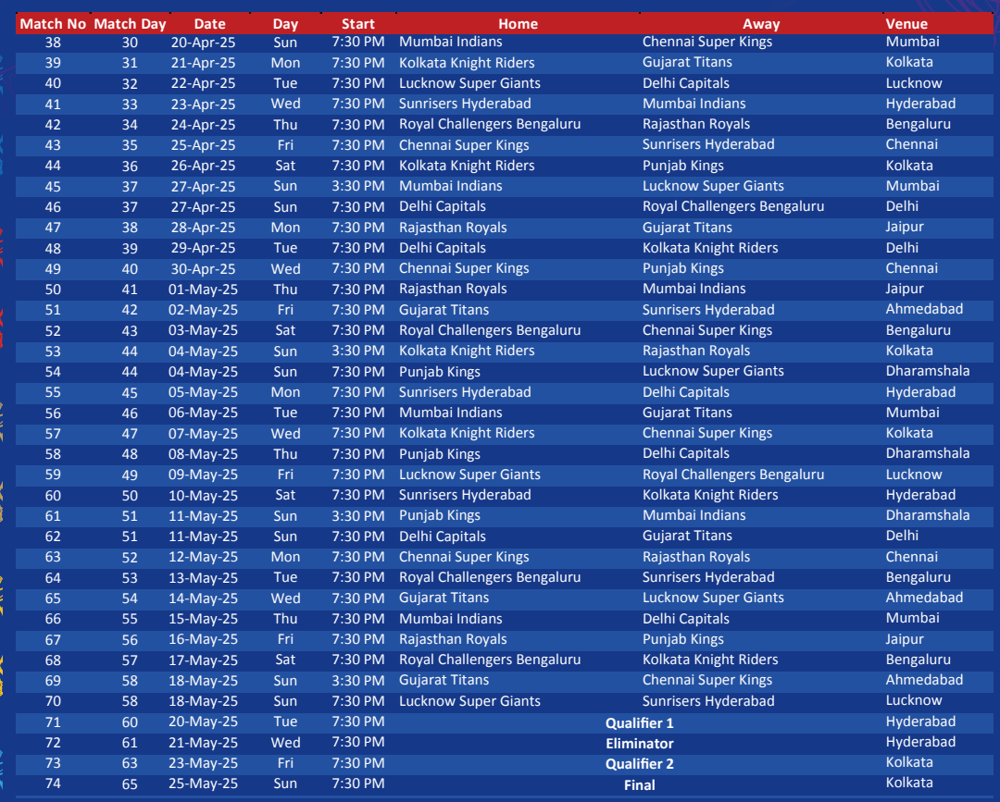

I am attaching a screenshot of the match details.

Team Mappings and their names as follows

1. Chennai Super Kings (CSK)
2. Delhi Capitals (DC)
3. Gujarat Titans (GT)
4. Kolkata Knight Riders (KKR)
5. Lucknow Super Giants (LSG)
6. Mumbai Indians (MI)
7. Punjab Kings (PK)
8. Rajasthan Royals (RR)
9. Royal Challengers Bangalore (RCB)
10. Sunrisers Hyderabad (SRH)


We need to generate the seed data for the match from the screenshot.

The data should be in the following format:

```
[
    {
      id: "1",
      matchNumber: "1",
      date: new Date("2025-03-22"),
      homeTeamId: "4",
      awayTeamId: "9",
    },
]
```

Screenshot reference: 





Column 1: Match No - Represents `id`
Column 2: Match Day - Ignore this
Column 3: Date - Represents `date`
Column 4: Day - Ignore this
Column 5: Start - Ignore this
Column 6: Home - Represents `homeTeamId`
Column 7: Away - Represents `awayTeamId`
Column 8: Venue - Ignore this


Note that date is in format `YYYY-MM-DD`, which in the result should be converted to `new Date("YYYY-MM-DD")`

The list has 74 matches. Let's create seed data only till 70. 