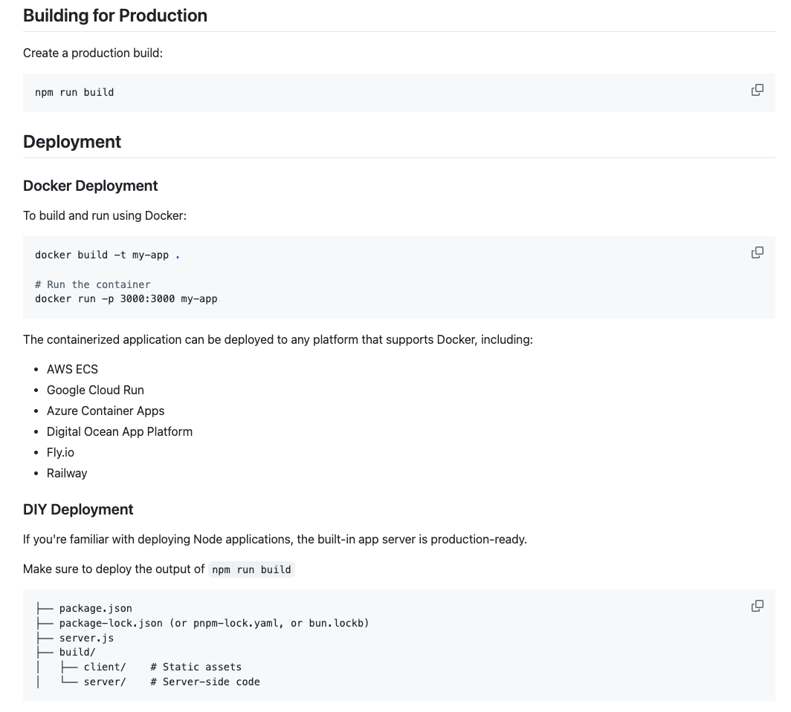

I am new to deploying docker containers and building the application. Help me deploy this application as mentioned in the documenation screenshot below.

With the instructions above, how do I deploy the application? Help me with the steps.

Go through the codebase to understand the application. This is a react router application, with server side rendering capabilities. It also uses prisma to connect to the SQLite database.

Keep this chat scope to only provide instructions on how to build and deploy the application. Feel free to ask me questions to help you understand the application.