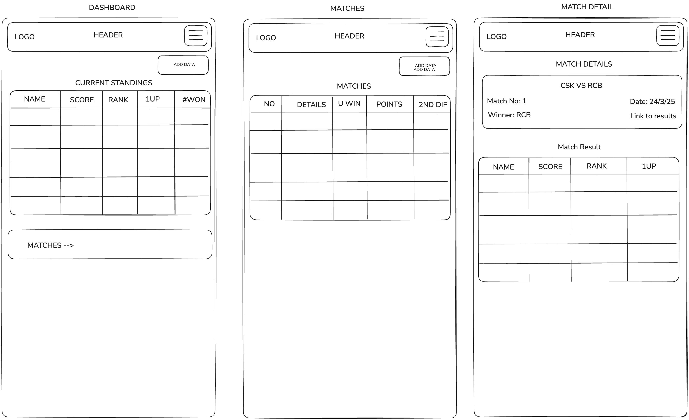
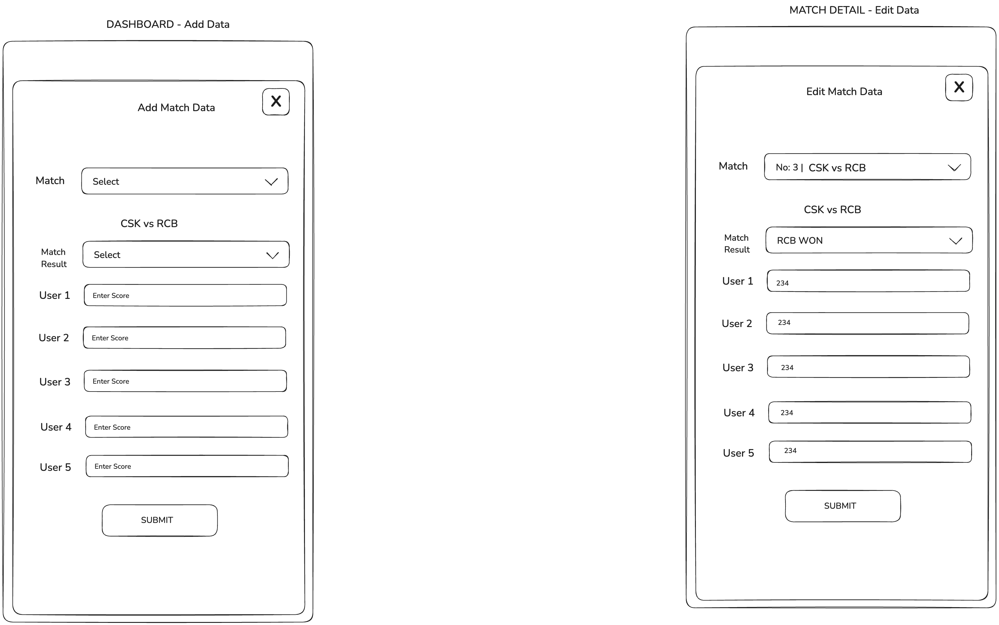

## Project requirements:

- We are building a project for a scorecard in which users can bet on the teams to get scores.
- A match scorecard tracks the users score for each match.
- The number of matches is predefined.
- For each match we will provide the score for each user. (There should be a way to provide this data)
- For each match there will be a winner, who has the highest score.
- Based on this data, we will sum up the scores of users across all the matches,
  and there will be an overall scorecard.
- This will be a mobile-only web application.

## Glossary

- Match: A match is a game. It will be played between two teams. These teams are
  predefined.
- Team: A predefined set of 10 teams.
- User: A user is a person who bets on the teams to get scores.
- Score: The score is the number of points a user gets for a match.
- Scorecard: A scorecard is table that lists users with their total score.
- Match Result: A match result is the score of all users of the match.

## Example of how the scorecard will look like

--> Teams: CSK, RCB, MI, KKR, RR, SRH, PBKS, GT, LSG, DC 
--> Users: User1, User2, User3, User4, User5

Match 1: CSK vs RCB

Score for Match 1:

User1: 100 User2: 250 User3: 300 User4: 450 User5: 500

Winner of Match 1: User5 (user who got the highest score)

--------------------------------

Match 2: MI vs KKR

Score for Match 2:

User1: 500 User2: 420 User3: 330 User4: 220 User5: 300

Winner of Match 2: User1 (user who got the highest score)

--------------------------------

Final Result:

User1: 100+500=600 
User2: 250+420=670 
User3: 300+330=630 
User4: 450+220=670
User5: 500+300=800

Ranking:

1. User5 with 800 points
2. User2 with 670 points
3. User4 with 670 points
4. User3 with 630 points
5. User1 with 600 points

## Tools:

- React Router framework
- Tailwind CSS for styling
- TypeScript for type safety
- Prisma with SQLite for database
- Vercel for deployment

## Header

This should have logo on top left and links to the following pages on top right:

- Dashboard
- Matches

## Pages

These are the pages for now:

- Dashboard
- Matches
- Match Result View

### Dashboard

This is the main page of the application.

This includes a widget/component to show the overall scorecard -
`OverallScoreCard`

This scorecard should be a table with the following columns:

- User Name
- Total Score
- Number of matches won
- Number of matches lost (last place in match)
- Ranking
- 1Up (Lists the difference of score to move to next rank)

Example:

Row 1:
- User Name: User1
- Total Score: 600
- Number of matches won: 1
- Number of matches lost: 0
- Ranking: 1
- 1Up: 100

Row 2, Row 3, Row 4 will be similar to above.

Should have links to the following pages:

- Matches

There will be a button "Add Data" at the top right of the page.

### Matches

This is the page where all the matches are listed.

It shows a table of matches with the following columns:

- Number
- Details
- Winner (represents user who got the highest score)
- Points
- 2nd Diff (difference of score compared to place 2)

Example:

- Number: 1
- Details: CSK vs RCB
- Winner: User5
- Points: 500
- 2nd Diff: 100 (means 2nd place got 400 points)

### Match Result View

This is the page where the result of a match is viewed.

It shows the following details:

Match Detail Card

- Number
- Winner
- Date
- Link to the match result

Match Result Card

- Name
- Score
- Rank
- 1Up

There will be a button to "Edit" the scorecard for that match.

## Add / Edit Data

This is a drawer that allows you to add or edit data for a match.

Add:

It has the following fields:

- Match Number - Select from dropdown
- Match Winner - Select from dropdown (Options Team 1 Won, Team 2 Won, Draw)
- Score for User 1 - Number input
- Score for User 2 - Number input
- Score for User 3 - Number input
- Score for User 4 - Number input
- Score for User 5 - Number input
- Submit Button

Edit:

It has the same fields as above, which is editable.

### Mockup

Add / Edit Data Drawer

